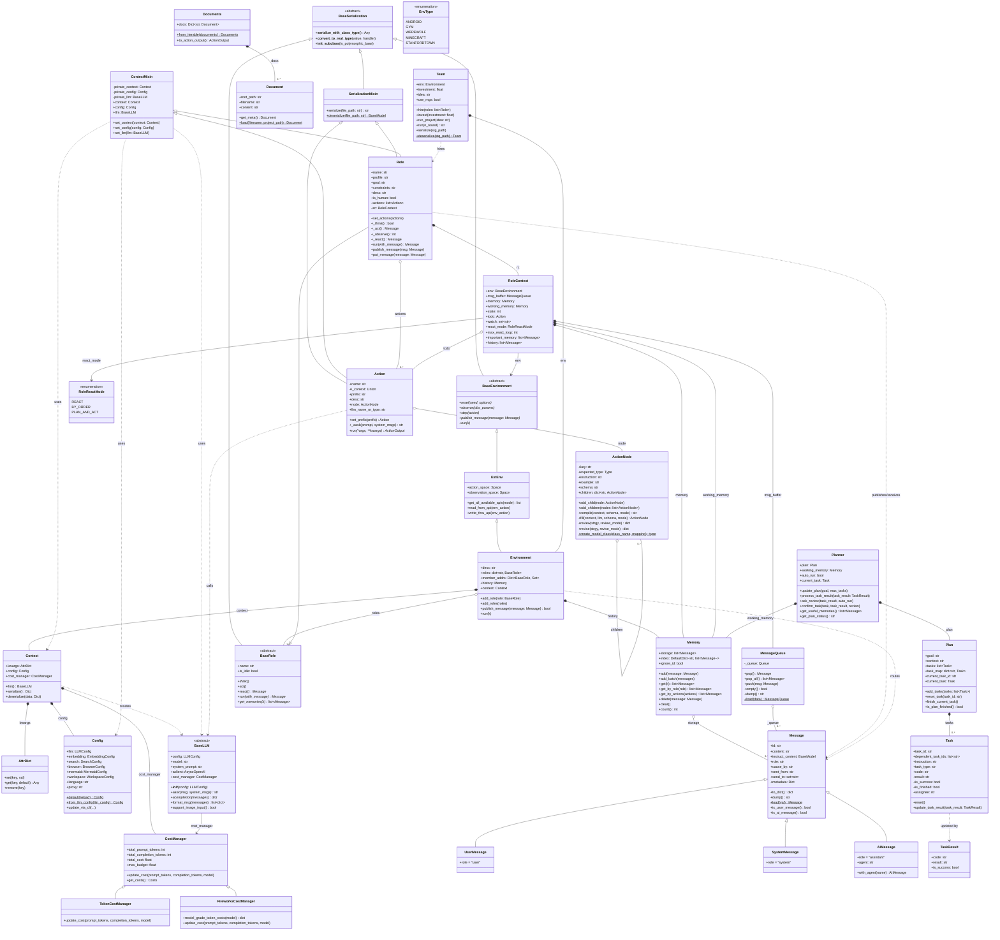

# Class UML Diagram — SdeTeam (MetaGPT)

```mermaid
classDiagram
    direction TB

    %% ============================================================
    %% FOUNDATION LAYER
    %% ============================================================

    class BaseSerialization {
        <<abstract>>
        +__serialize_with_class_type__() Any
        +__convert_to_real_type__(value, handler)
        +__init_subclass__(is_polymorphic_base)
    }

    class SerializationMixin {
        +serialize(file_path: str) str
        +deserialize(file_path: str)$ BaseModel
    }

    class ContextMixin {
        -private_context: Context
        -private_config: Config
        -private_llm: BaseLLM
        +set_context(context: Context)
        +set_config(config: Config)
        +set_llm(llm: BaseLLM)
        +context: Context
        +config: Config
        +llm: BaseLLM
    }

    %% ============================================================
    %% CONFIGURATION & CONTEXT LAYER
    %% ============================================================

    class AttrDict {
        +set(key, val)
        +get(key, default) Any
        +remove(key)
    }

    class Config {
        +llm: LLMConfig
        +embedding: EmbeddingConfig
        +search: SearchConfig
        +browser: BrowserConfig
        +mermaid: MermaidConfig
        +workspace: WorkspaceConfig
        +language: str
        +proxy: str
        +default(reload)$ Config
        +from_llm_config(llm_config)$ Config
        +update_via_cli(...)
    }

    class Context {
        +kwargs: AttrDict
        +config: Config
        +cost_manager: CostManager
        +llm() BaseLLM
        +serialize() Dict
        +deserialize(data: Dict)
    }

    %% ============================================================
    %% LLM PROVIDER LAYER
    %% ============================================================

    class BaseLLM {
        <<abstract>>
        +config: LLMConfig
        +model: str
        +system_prompt: str
        +aclient: AsyncOpenAI
        +cost_manager: CostManager
        +__init__(config: LLMConfig)*
        +aask(msg, system_msgs)* str
        +acompletion(messages)* dict
        +format_msg(messages) list~dict~
        +support_image_input() bool
    }

    class CostManager {
        +total_prompt_tokens: int
        +total_completion_tokens: int
        +total_cost: float
        +max_budget: float
        +update_cost(prompt_tokens, completion_tokens, model)
        +get_costs() Costs
    }

    class TokenCostManager {
        +update_cost(prompt_tokens, completion_tokens, model)
    }

    class FireworksCostManager {
        +model_grade_token_costs(model) dict
        +update_cost(prompt_tokens, completion_tokens, model)
    }

    %% ============================================================
    %% MESSAGE & SCHEMA LAYER
    %% ============================================================

    class Message {
        +id: str
        +content: str
        +instruct_content: BaseModel
        +role: str
        +cause_by: str
        +sent_from: str
        +send_to: set~str~
        +metadata: Dict
        +to_dict() dict
        +dump() str
        +load(val)$ Message
        +is_user_message() bool
        +is_ai_message() bool
    }

    class UserMessage {
        +role = "user"
    }

    class SystemMessage {
        +role = "system"
    }

    class AIMessage {
        +role = "assistant"
        +with_agent(name) AIMessage
        +agent: str
    }

    class MessageQueue {
        -_queue: Queue
        +pop() Message
        +pop_all() list~Message~
        +push(msg: Message)
        +empty() bool
        +dump() str
        +load(data)$ MessageQueue
    }

    class Document {
        +root_path: str
        +filename: str
        +content: str
        +get_meta() Document
        +load(filename, project_path)$ Document
    }

    class Documents {
        +docs: Dict~str, Document~
        +from_iterable(documents)$ Documents
        +to_action_output() ActionOutput
    }

    class Task {
        +task_id: str
        +dependent_task_ids: list~str~
        +instruction: str
        +task_type: str
        +code: str
        +result: str
        +is_success: bool
        +is_finished: bool
        +assignee: str
        +reset()
        +update_task_result(task_result: TaskResult)
    }

    class TaskResult {
        +code: str
        +result: str
        +is_success: bool
    }

    class Plan {
        +goal: str
        +context: str
        +tasks: list~Task~
        +task_map: dict~str, Task~
        +current_task_id: str
        +add_tasks(tasks: list~Task~)
        +reset_task(task_id: str)
        +finish_current_task()
        +is_plan_finished() bool
        +current_task: Task
    }

    %% ============================================================
    %% MEMORY LAYER
    %% ============================================================

    class Memory {
        +storage: list~Message~
        +index: DefaultDict~str, list~Message~~
        +ignore_id: bool
        +add(message: Message)
        +add_batch(messages)
        +get(k) list~Message~
        +get_by_role(role) list~Message~
        +get_by_actions(actions) list~Message~
        +delete(message: Message)
        +clear()
        +count() int
    }

    %% ============================================================
    %% ACTION LAYER
    %% ============================================================

    class Action {
        +name: str
        +i_context: Union
        +prefix: str
        +desc: str
        +node: ActionNode
        +llm_name_or_type: str
        +set_prefix(prefix) Action
        +_aask(prompt, system_msgs) str
        +run(*args, **kwargs)* ActionOutput
    }

    class ActionNode {
        +key: str
        +expected_type: Type
        +instruction: str
        +example: str
        +schema: str
        +children: dict~str, ActionNode~
        +add_child(node: ActionNode)
        +add_children(nodes: list~ActionNode~)
        +compile(context, schema, mode) str
        +fill(context, llm, schema, mode) ActionNode
        +review(strgy, review_mode) dict
        +revise(strgy, revise_mode) dict
        +create_model_class(class_name, mapping)$ type
    }

    %% ============================================================
    %% ROLE LAYER
    %% ============================================================

    class BaseRole {
        <<abstract>>
        +name: str
        +is_idle: bool
        +think()*
        +act()*
        +react()* Message
        +run(with_message)* Message
        +get_memories(k)* list~Message~
    }

    class RoleReactMode {
        <<enumeration>>
        REACT
        BY_ORDER
        PLAN_AND_ACT
    }

    class RoleContext {
        +env: BaseEnvironment
        +msg_buffer: MessageQueue
        +memory: Memory
        +working_memory: Memory
        +state: int
        +todo: Action
        +watch: set~str~
        +react_mode: RoleReactMode
        +max_react_loop: int
        +important_memory: list~Message~
        +history: list~Message~
    }

    class Role {
        +name: str
        +profile: str
        +goal: str
        +constraints: str
        +desc: str
        +is_human: bool
        +actions: list~Action~
        +rc: RoleContext
        +set_actions(actions)
        +_think() bool
        +_act() Message
        +_observe() int
        +_react() Message
        +run(with_message) Message
        +publish_message(msg: Message)
        +put_message(message: Message)
    }

    %% ============================================================
    %% ENVIRONMENT LAYER
    %% ============================================================

    class BaseEnvironment {
        <<abstract>>
        +reset(seed, options)*
        +observe(obs_params)*
        +step(action)*
        +publish_message(message: Message)*
        +run(k)*
    }

    class EnvType {
        <<enumeration>>
        ANDROID
        GYM
        WEREWOLF
        MINECRAFT
        STANFORDTOWN
    }

    class ExtEnv {
        +action_space: Space
        +observation_space: Space
        +get_all_available_apis(mode) list
        +read_from_api(env_action)
        +write_thru_api(env_action)
    }

    class Environment {
        +desc: str
        +roles: dict~str, BaseRole~
        +member_addrs: Dict~BaseRole, Set~
        +history: Memory
        +context: Context
        +add_role(role: BaseRole)
        +add_roles(roles)
        +publish_message(message: Message) bool
        +run(k)
    }

    %% ============================================================
    %% TEAM / ORCHESTRATION LAYER
    %% ============================================================

    class Team {
        +env: Environment
        +investment: float
        +idea: str
        +use_mgx: bool
        +hire(roles: list~Role~)
        +invest(investment: float)
        +run_project(idea: str)
        +run(n_round) str
        +serialize(stg_path)
        +deserialize(stg_path)$ Team
    }

    %% ============================================================
    %% STRATEGY LAYER
    %% ============================================================

    class Planner {
        +plan: Plan
        +working_memory: Memory
        +auto_run: bool
        +current_task: Task
        +update_plan(goal, max_tasks)
        +process_task_result(task_result: TaskResult)
        +ask_review(task_result, auto_run)
        +confirm_task(task, task_result, review)
        +get_useful_memories() list~Message~
        +get_plan_status() str
    }

    %% ============================================================
    %% INHERITANCE RELATIONSHIPS
    %% ============================================================

    BaseSerialization <|-- SerializationMixin
    BaseSerialization <|-- BaseRole
    BaseSerialization <|-- BaseEnvironment

    BaseRole <|-- Role
    SerializationMixin <|-- Role
    ContextMixin <|-- Role

    SerializationMixin <|-- Action
    ContextMixin <|-- Action

    BaseEnvironment <|-- ExtEnv
    ExtEnv <|-- Environment

    Message <|-- UserMessage
    Message <|-- SystemMessage
    Message <|-- AIMessage

    CostManager <|-- TokenCostManager
    CostManager <|-- FireworksCostManager

    %% ============================================================
    %% COMPOSITION RELATIONSHIPS
    %% ============================================================

    Team *-- Environment : env
    Environment *-- Memory : history
    Environment *-- Context : context
    Environment o-- "0..*" BaseRole : roles

    Role *-- RoleContext : rc
    Role o-- "0..*" Action : actions

    RoleContext *-- Memory : memory
    RoleContext *-- Memory : working_memory
    RoleContext *-- MessageQueue : msg_buffer
    RoleContext o-- Action : todo
    RoleContext --> BaseEnvironment : env
    RoleContext --> RoleReactMode : react_mode

    Action o-- ActionNode : node

    ActionNode o-- "0..*" ActionNode : children

    Context *-- AttrDict : kwargs
    Context *-- Config : config
    Context *-- CostManager : cost_manager
    Context ..> BaseLLM : creates

    ContextMixin ..> Context : uses
    ContextMixin ..> Config : uses
    ContextMixin ..> BaseLLM : uses

    Plan *-- "0..*" Task : tasks
    Task ..> TaskResult : updated by

    Planner *-- Plan : plan
    Planner *-- Memory : working_memory

    Memory o-- "0..*" Message : storage
    MessageQueue o-- "0..*" Message : _queue

    Documents *-- "0..*" Document : docs

    BaseLLM --> CostManager : cost_manager

    %% ============================================================
    %% DEPENDENCY RELATIONSHIPS
    %% ============================================================

    Role ..> Message : publishes/receives
    Environment ..> Message : routes
    Action ..> BaseLLM : calls
    Team ..> Role : hires
```
