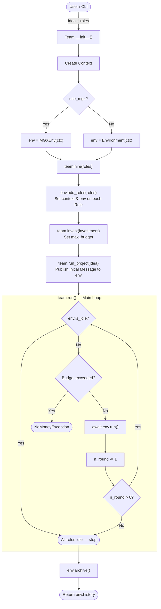
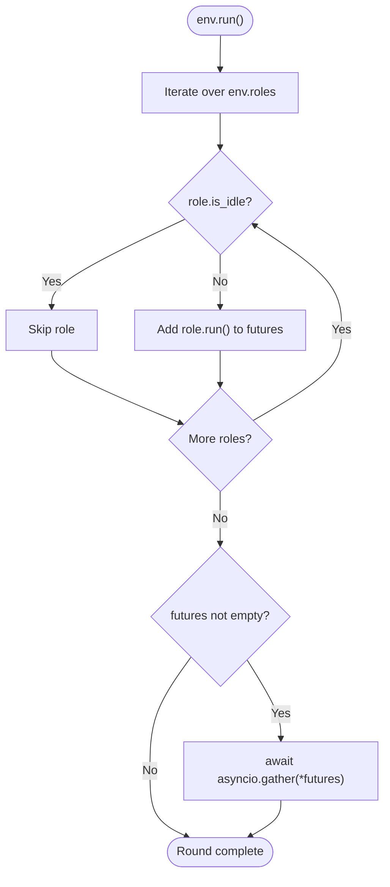
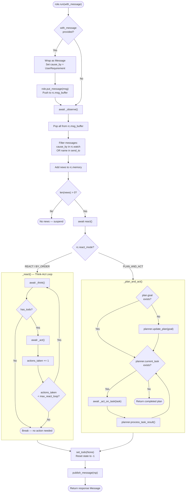
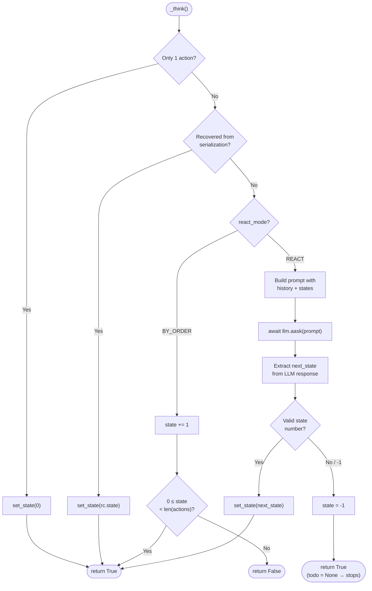
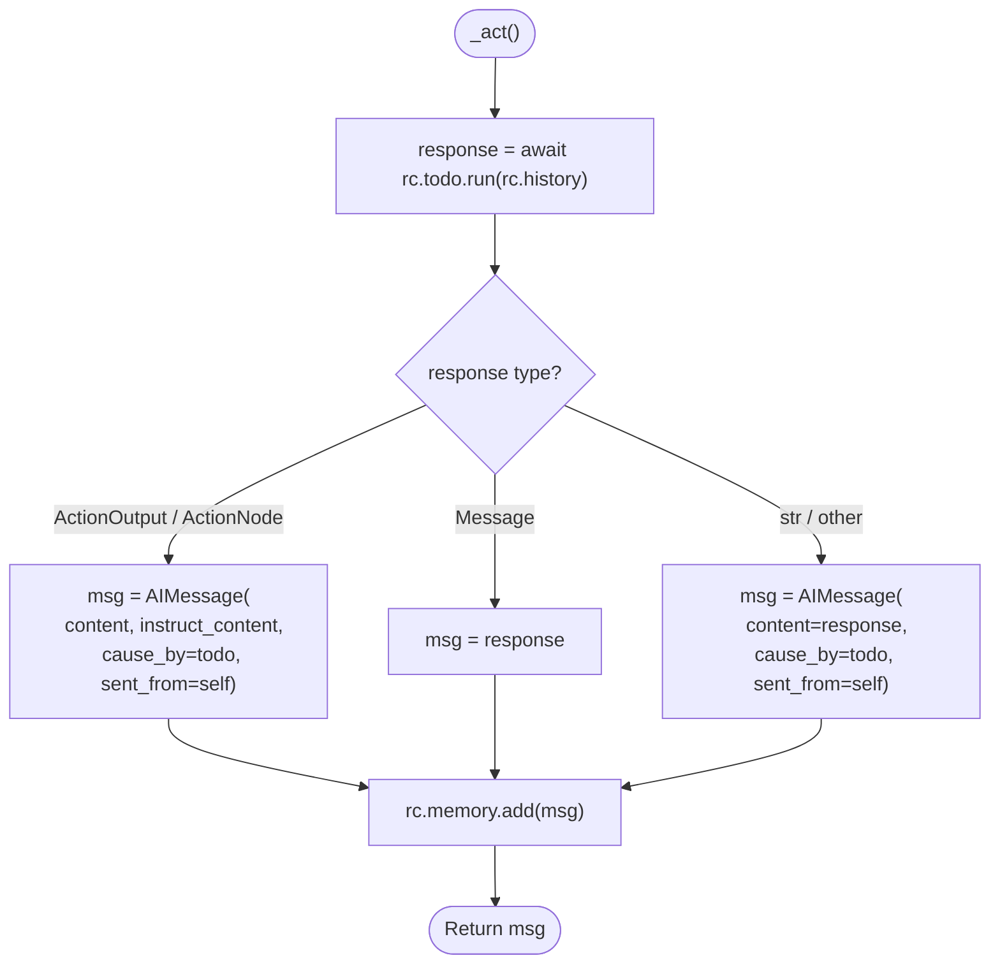
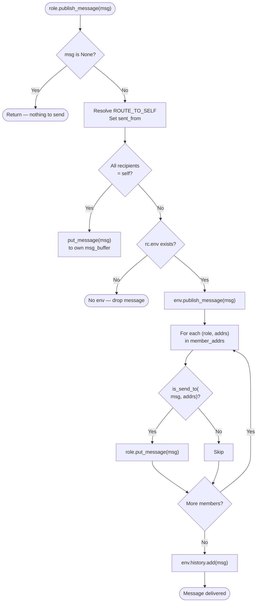
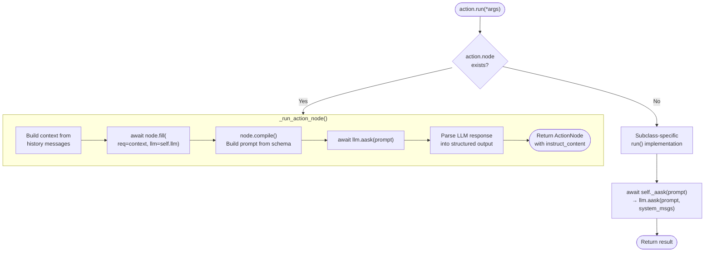
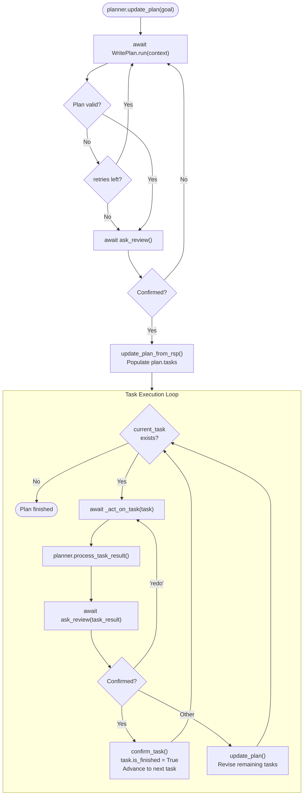
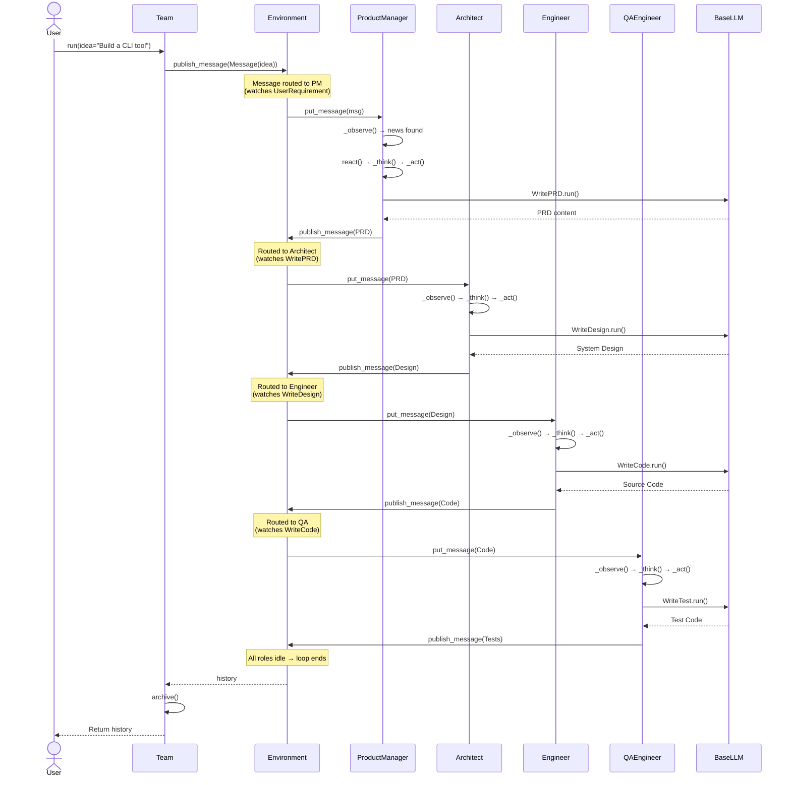

# Flow UML Diagram — SdeTeam (MetaGPT)

## 1. Main Execution Flow

## 2. Environment Run — Parallel Role Execution

## 3. Role Execution Lifecycle — role.run()

## 4. Role._think() — Action Selection

## 5. Role._act() — Action Execution

## 6. Message Routing — publish_message

## 7. Action.run() — LLM Interaction

## 8. Planner Task Lifecycle

## 9. End-to-End Sequence (Software Company Example)

