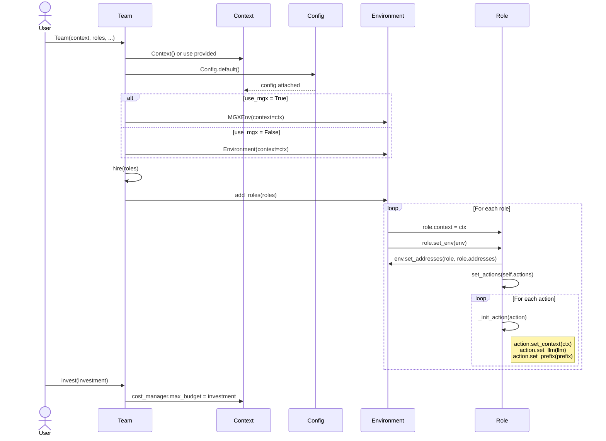
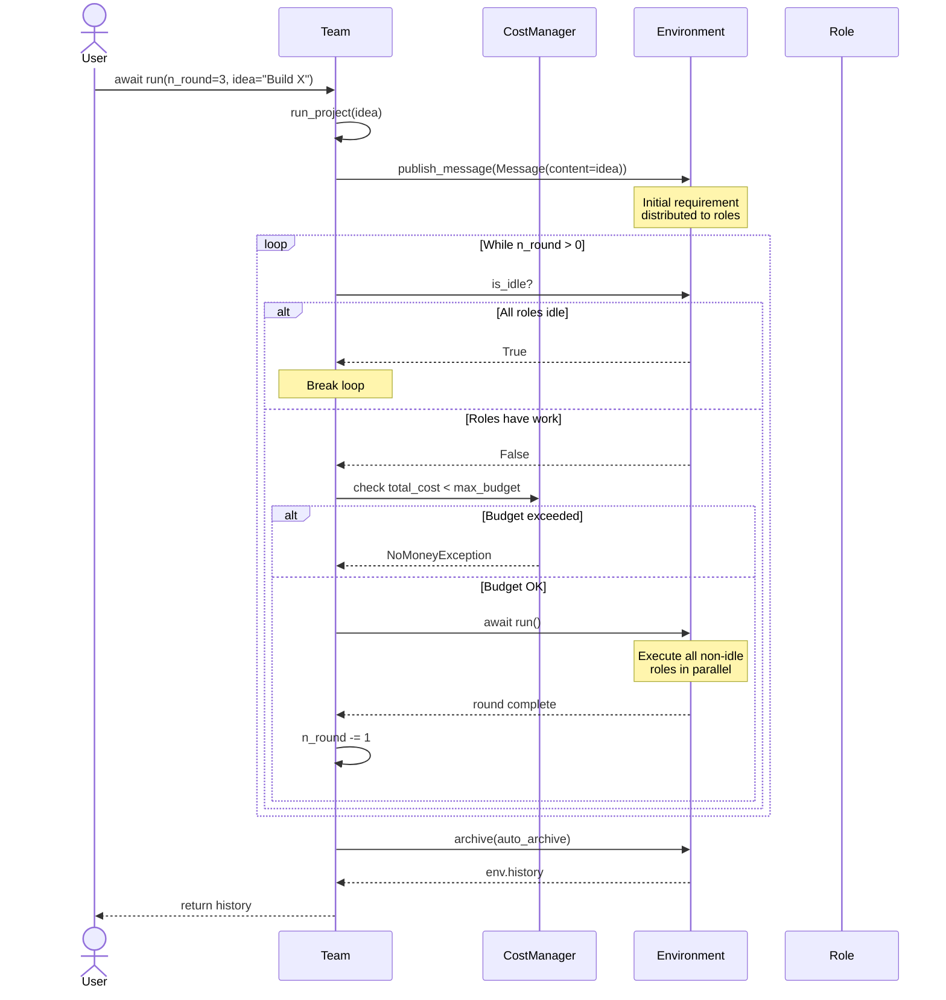
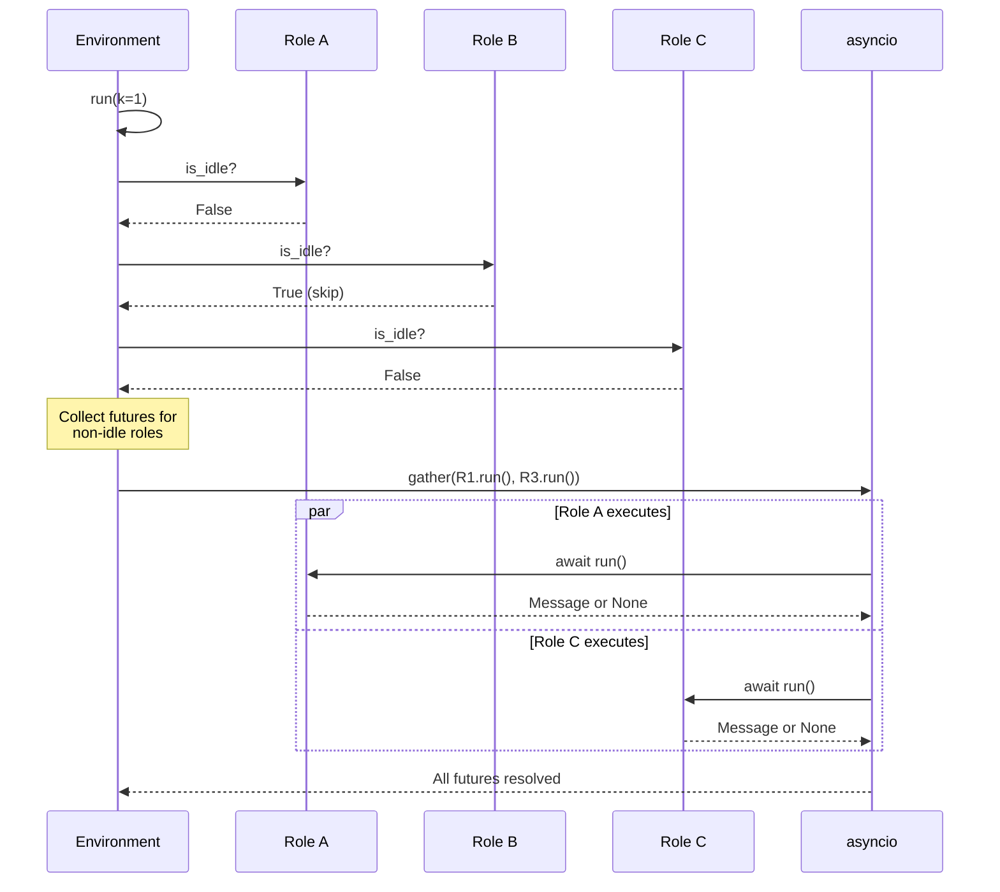
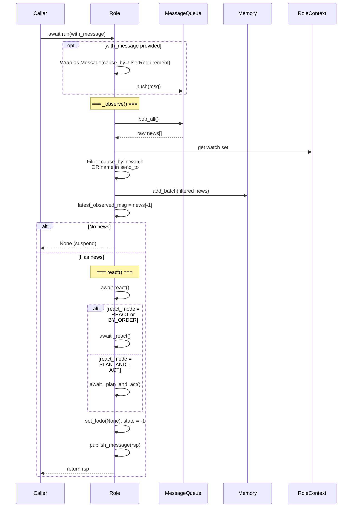
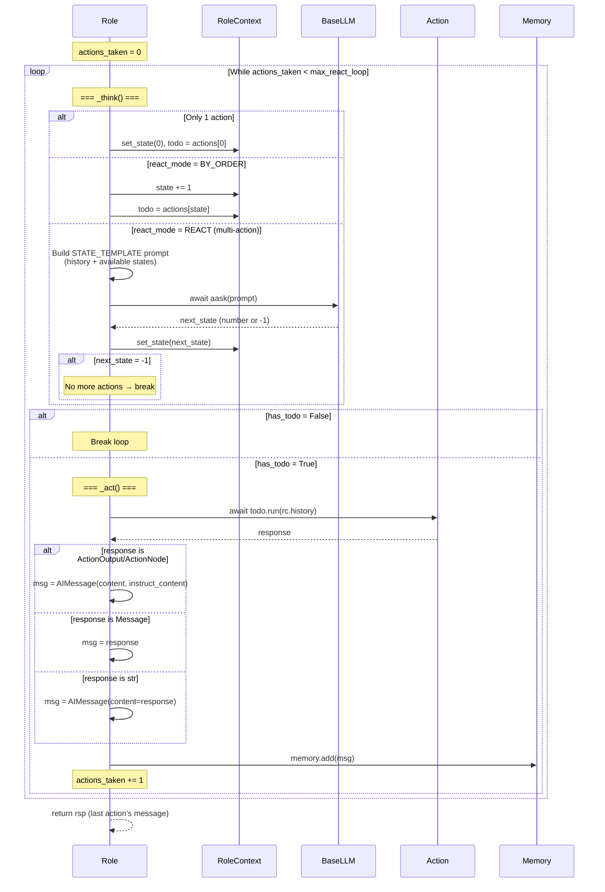
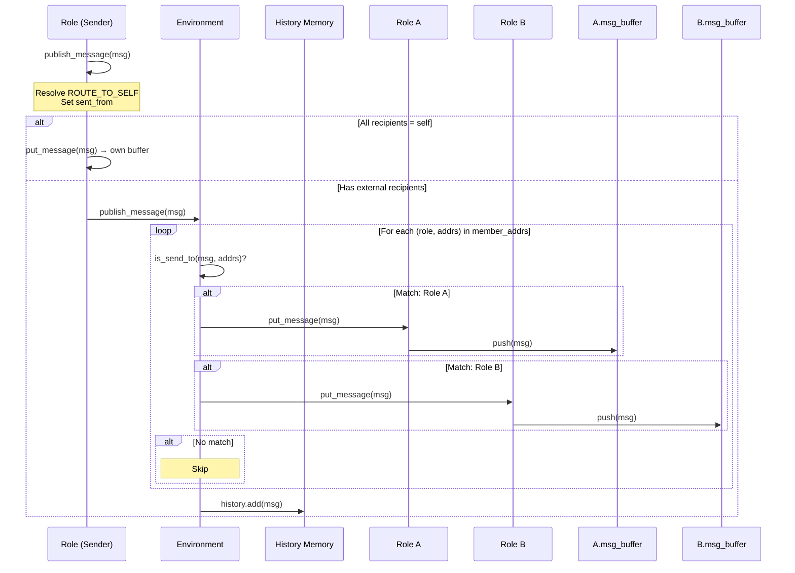
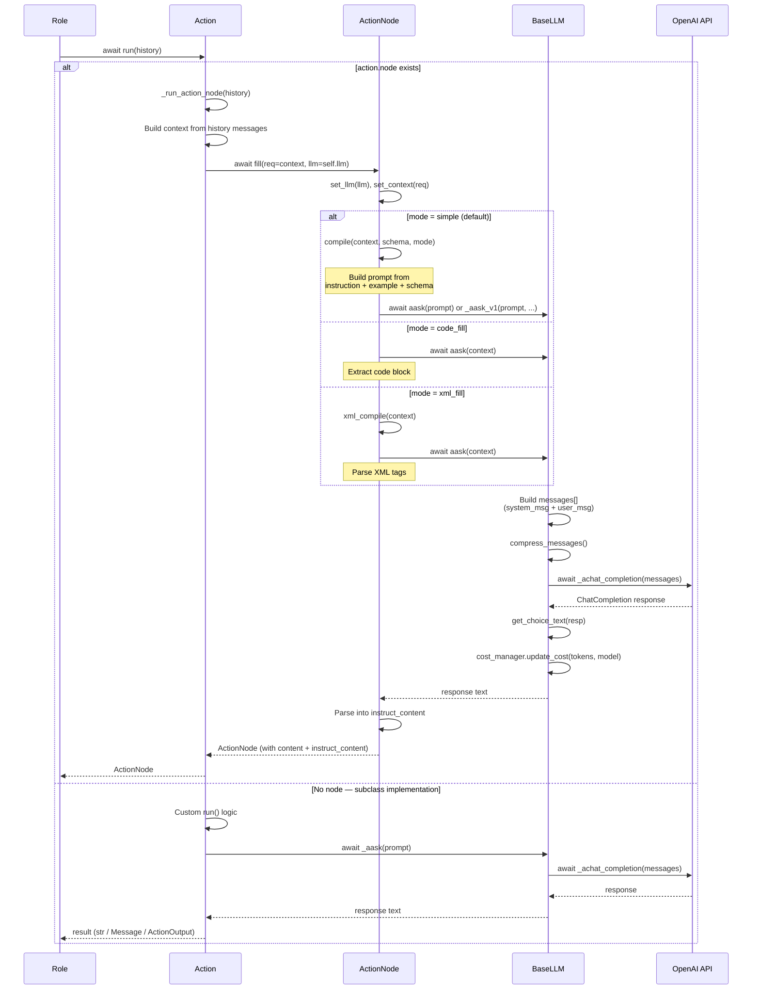
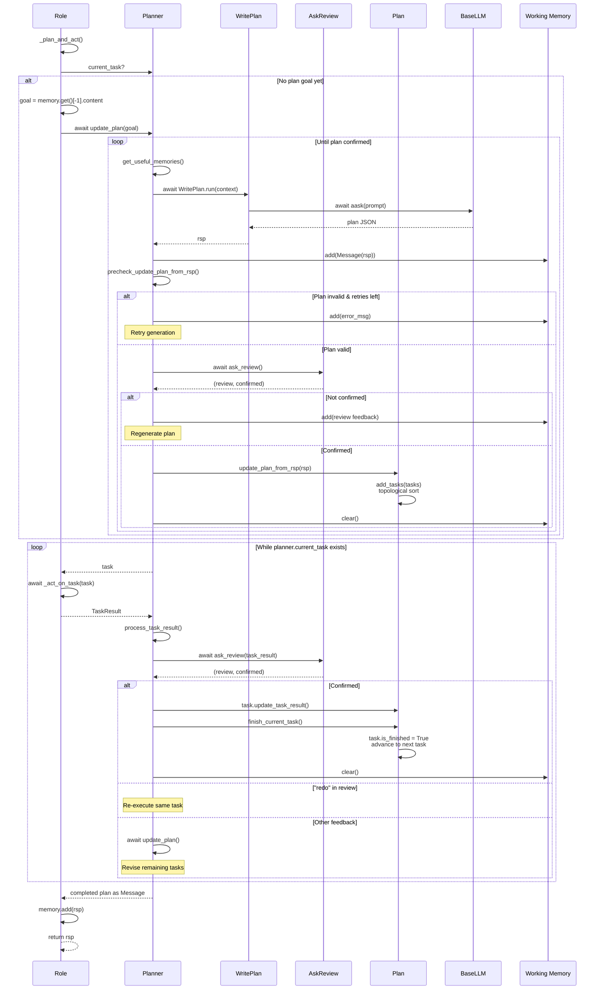
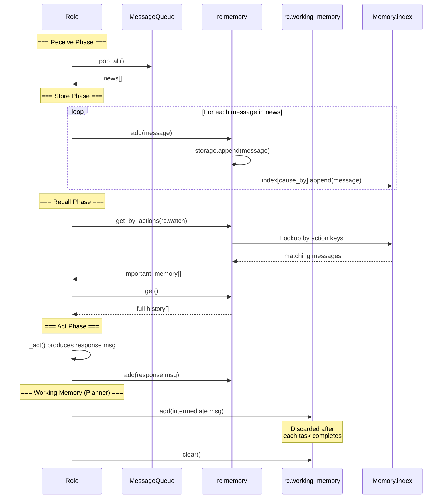
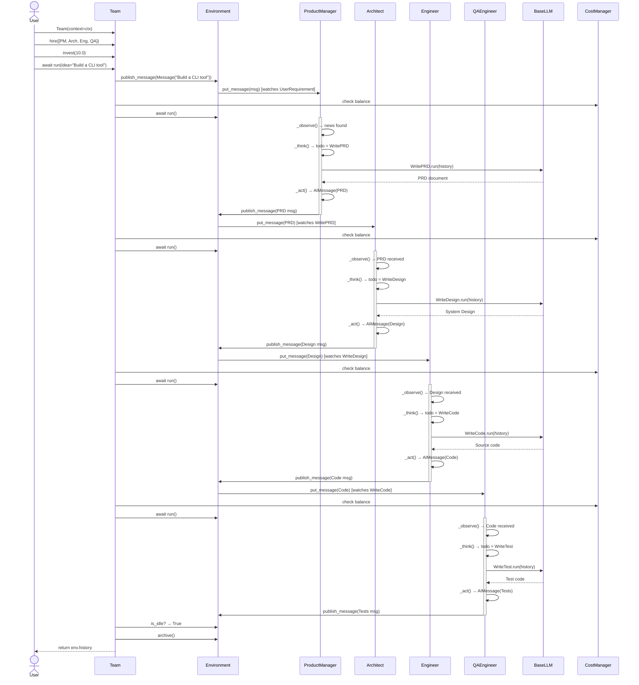

# Sequence UML Diagrams — SdeTeam (MetaGPT)

## 1. Team Initialization & Setup

## 2. Team.run() — Main Execution Loop

## 3. Environment.run() — Parallel Role Dispatch

## 4. Role.run() — Full Observe-React Cycle

## 5. Role._react() — Think-Act Loop (REACT / BY_ORDER)

## 6. Message Publishing & Routing

## 7. Action.run() → LLM Call Chain

## 8. Plan-and-Act Strategy (Planner Lifecycle)

## 9. Memory Operations During Role Lifecycle

## 10. End-to-End Software Company — Full Sequence

