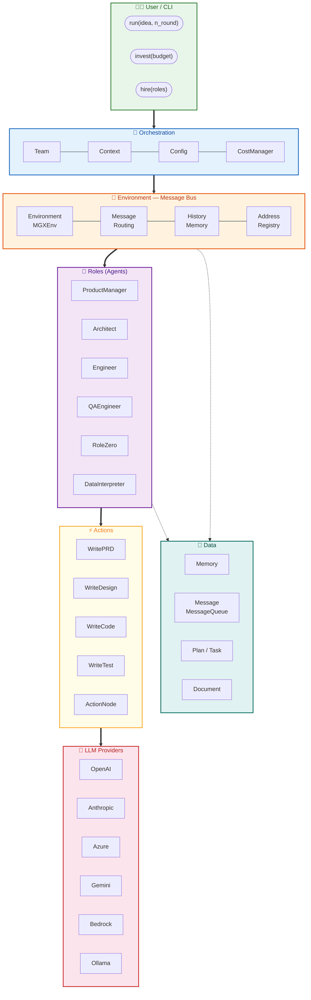

# 1. System Overview — Layered Architecture

> **Talking point:** 7 层自顶向下：User 只接触 Team → Team 通过 Environment（消息总线）调度 Roles → 每个 Role 执行 Action 调用 LLM → 所有状态存储在 Data 层。实线 `==>` 表示调用链，虚线 `-.->` 表示数据读写。
