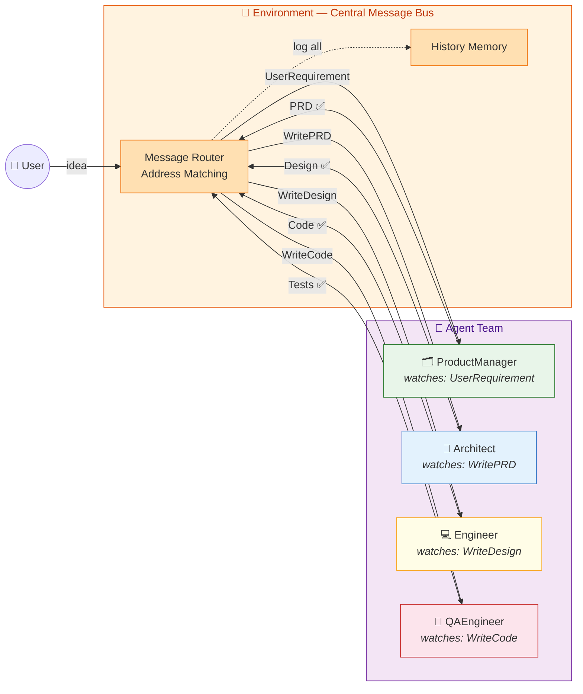

# 2. Multi-Agent Collaboration — SOP-Driven Pipeline

> **Talking point:** Agents don't talk to each other directly. Every message flows through the Environment, which routes it based on what each Role "watches." This creates a clean SOP pipeline: User → PM → Architect → Engineer → QA, with each agent triggered automatically when its upstream dependency publishes a result.
