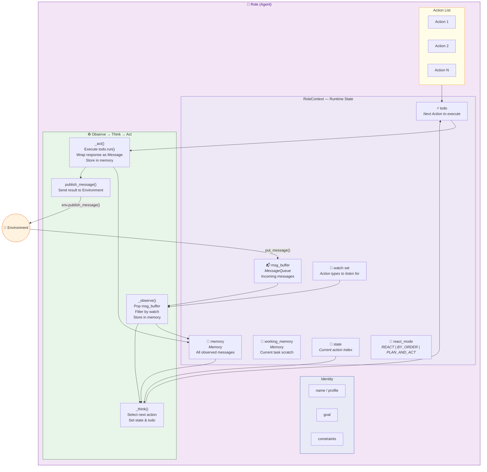

# 3. Role Internals — Anatomy of an Agent

> **Talking point:** Each Role is a self-contained agent. It has an identity (name, goal, constraints), a runtime context (message buffer, memory, watch set), and a list of Actions it can perform. The core loop is simple: observe new messages → think about what to do → act on it → publish the result back to the Environment.
