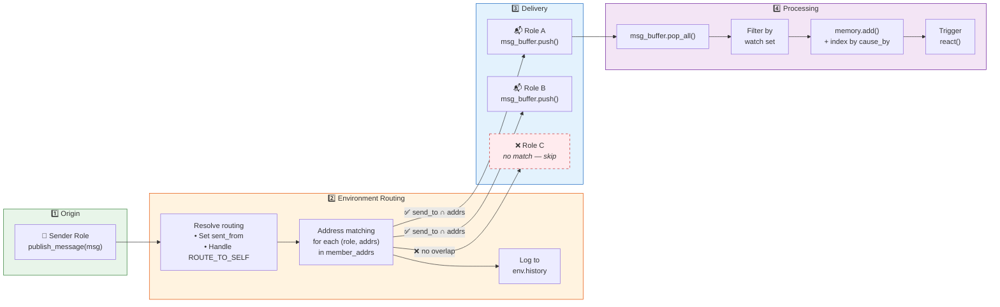
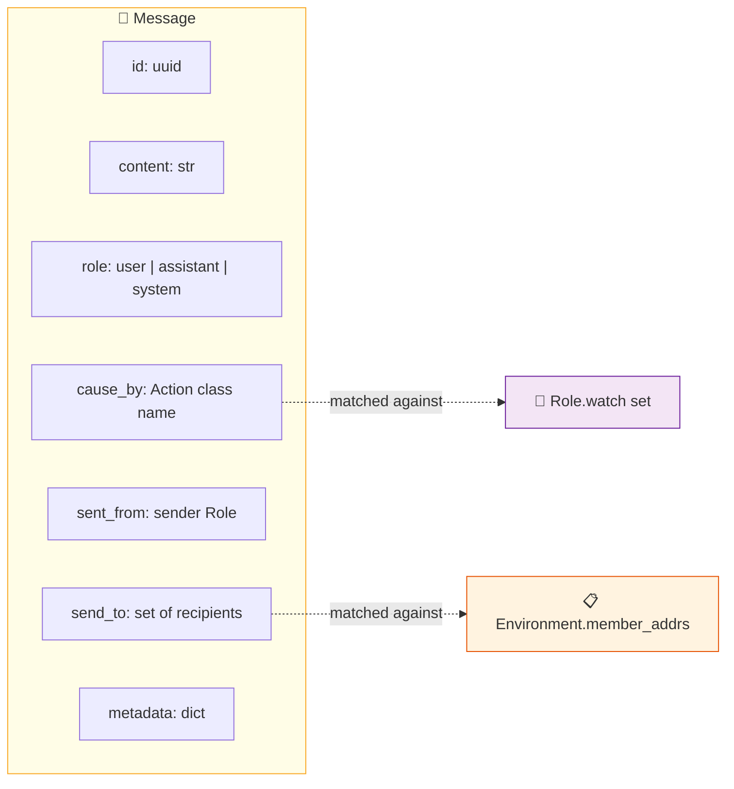

# 4. Message Lifecycle — Pub/Sub Routing

### Message Structure

> **Talking point:** Messages are the only way agents communicate. A sender publishes a Message to the Environment, which checks each registered Role's address set. Matching roles receive the message in their private buffer. During `_observe()`, the role filters messages by its watch set (the Action types it cares about), stores them in memory, and triggers the react cycle. It's a clean pub/sub pattern with content-based routing.
