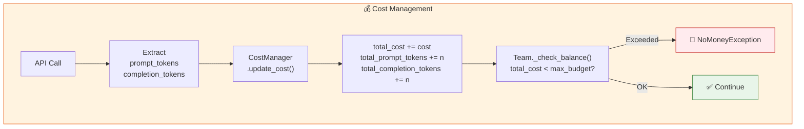

# 5. LLM Interaction Pipeline

```mermaid
graph LR
    subgraph Trigger ["1️⃣ Trigger"]
        Role["🤖 Role._act()"]
    end

    subgraph ActionLayer ["2️⃣ Action Layer"]
        direction TB
        Action["⚡ Action.run(history)"]
        Node["ActionNode.fill()"]
        Compile["compile()<br/>Build prompt from<br/>instruction + example<br/>+ schema (json/md/raw)"]
    end

    subgraph LLMLayer ["3️⃣ LLM Layer"]
        direction TB
        Aask["BaseLLM.aask()<br/>Build messages[]<br/>system_msg + user_msg"]
        Compress["compress_messages()<br/><i>if configured</i>"]
        Complete["acompletion_text()"]
        Stream{"stream?"}
        Chat["_achat_completion()"]
        StreamChat["_achat_completion_stream()"]
    end

    subgraph APILayer ["4️⃣ External API"]
        API["☁️ OpenAI / Anthropic<br/>Azure / Gemini / Bedrock<br/>Ollama / ..."]
    end

    subgraph Response ["5️⃣ Response"]
        direction TB
        Parse["Parse response<br/>→ content + instruct_content"]
        Cost["CostManager.update_cost()<br/>prompt_tokens + completion_tokens"]
        Result["Return to Role<br/>→ wrap as AIMessage<br/>→ store in memory"]
    end

    Role --> Action
    Action --> Node
    Node --> Compile
    Compile --> Aask
    Aask --> Compress
    Compress --> Complete
    Complete --> Stream
    Stream -- "No" --> Chat
    Stream -- "Yes" --> StreamChat
    Chat --> API
    StreamChat --> API
    API --> Parse
    Parse --> Cost
    Cost --> Result

    style Trigger fill:#F3E5F5,stroke:#6A1B9A
    style ActionLayer fill:#FFFDE7,stroke:#F9A825
    style LLMLayer fill:#E3F2FD,stroke:#1565C0
    style APILayer fill:#FCE4EC,stroke:#C62828
    style Response fill:#E8F5E9,stroke:#2E7D32
```

### Cost Tracking

> **Talking point:** Every LLM call follows the same pipeline. The Role triggers an Action, which compiles a structured prompt via ActionNode, sends it through BaseLLM (which handles message formatting and compression), and calls the external API. The response is parsed back into structured content, costs are tracked per-call, and the Team checks the budget after every round. If the budget is exceeded, the entire run stops gracefully.
