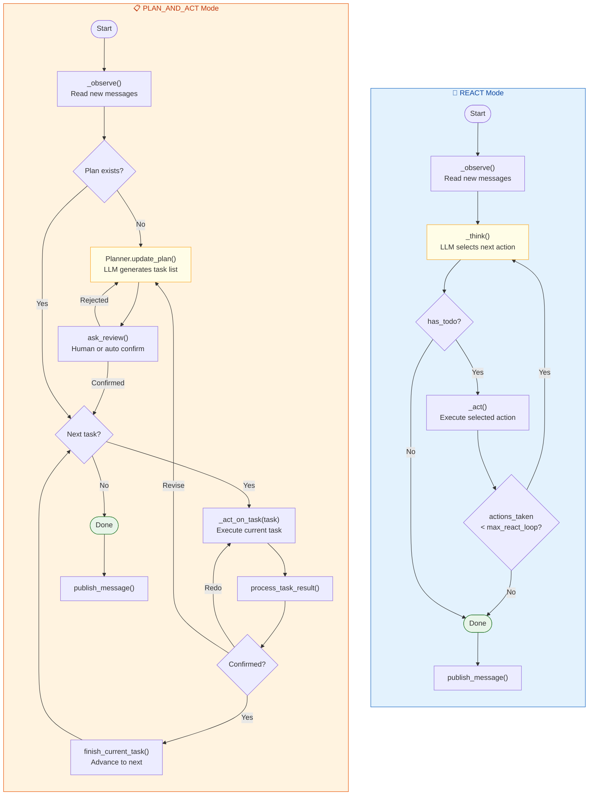

# 6. React vs Plan-and-Act — Two Agent Strategies

## Side-by-Side Comparison

## When to Use Which

```mermaid
graph LR
    subgraph Comparison ["⚖️ Strategy Comparison"]
        direction TB

        subgraph ReactBox ["🔄 REACT"]
            direction TB
            R1["✅ Simple, fast"]
            R2["✅ Good for single-action roles"]
            R3["✅ LLM picks action dynamically"]
            R4["⚠️ Limited lookahead"]
            R5["📌 Used by: PM, Architect, QA"]
        end

        subgraph ByOrderBox ["📑 BY_ORDER"]
            direction TB
            B1["✅ Deterministic sequence"]
            B2["✅ No LLM overhead for selection"]
            B3["✅ Predictable execution"]
            B4["⚠️ No adaptive behavior"]
            B5["📌 Used by: fixed pipelines"]
        end

        subgraph PlanBox ["📋 PLAN_AND_ACT"]
            direction TB
            P1["✅ Handles complex multi-step tasks"]
            P2["✅ Human review gates"]
            P3["✅ Can revise plan mid-execution"]
            P4["⚠️ Higher LLM cost"]
            P5["📌 Used by: DataInterpreter, RoleZero"]
        end
    end

    style Comparison fill:#FAFAFA,stroke:#9E9E9E
    style ReactBox fill:#E3F2FD,stroke:#1565C0
    style ByOrderBox fill:#F3E5F5,stroke:#6A1B9A
    style PlanBox fill:#FFF3E0,stroke:#E65100
```

> **Talking point:** The framework supports three reaction strategies. REACT is the default — a think-act loop where the LLM dynamically picks the next action each cycle. BY_ORDER runs actions in a fixed sequence with no LLM overhead. PLAN_AND_ACT is the most sophisticated — the LLM first generates a full task plan, then executes tasks one by one with review gates between each step. The plan can be revised mid-flight based on feedback. Simple roles use REACT; complex autonomous agents like DataInterpreter use PLAN_AND_ACT.
