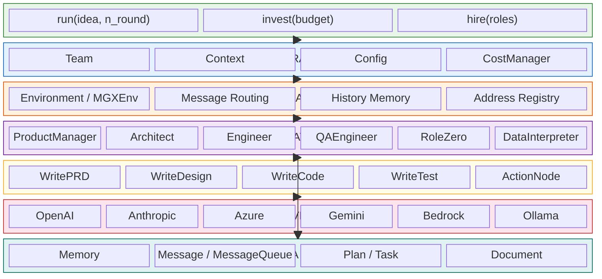

# 1. System Overview — Layered Architecture

> **Talking point:** The system is organized in clean layers. The User interacts only with the Team. The Team orchestrates Roles through an Environment that acts as a message bus. Each Role executes Actions that call LLM providers, with all state managed in the Data layer.
